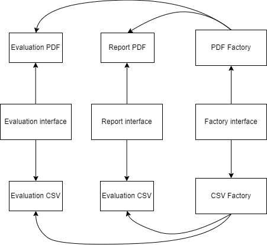

# Reports generator

## Description
This is a simple project to demonstrate the use of the abstract factory design pattern in java. It's just a training project.
The main goal of this project is to create reports using the abstract factory design pattern.

## Structure
- `Report` is the interface that defines the methods that the report classes must implement. In our case, the method is `generate()`.
- `PdfReport` and `CSVReport` are the classes that implement the `Report` interface. Each class implements the `generate()` method according to the type of report.
- `ReportFactory` is the interface that defines the method that the report factory classes must implement. In our case, the methods are `createReport()` and `createEvaluation()`
- `PdfReportFactory` and `CSVReportFactory` are the classes that implement the `ReportFactory` interface. Each class implements the `createReport()` method according to the type of report.

## Schema

## Resources
- Refactoring guru Ebook
- [Refactoring guru](https://refactoring.guru/design-patterns/abstract-factory) website